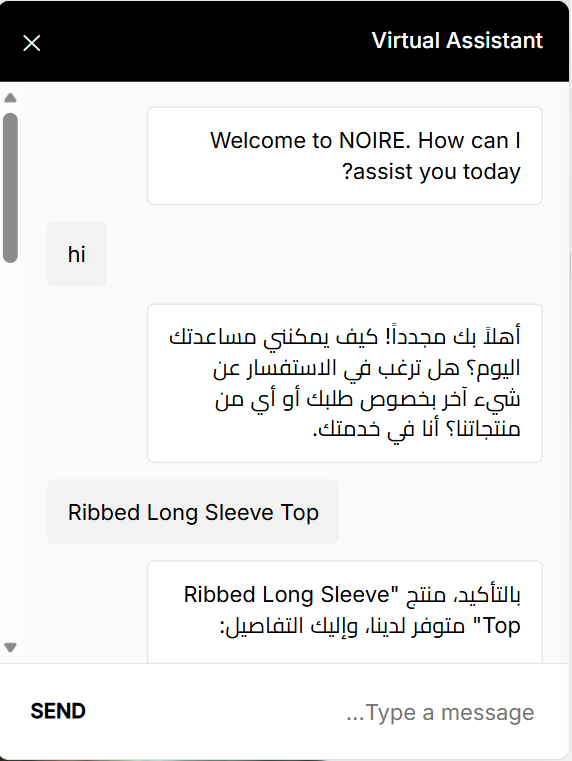
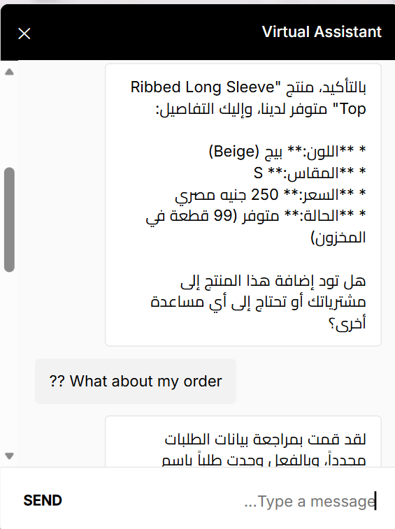
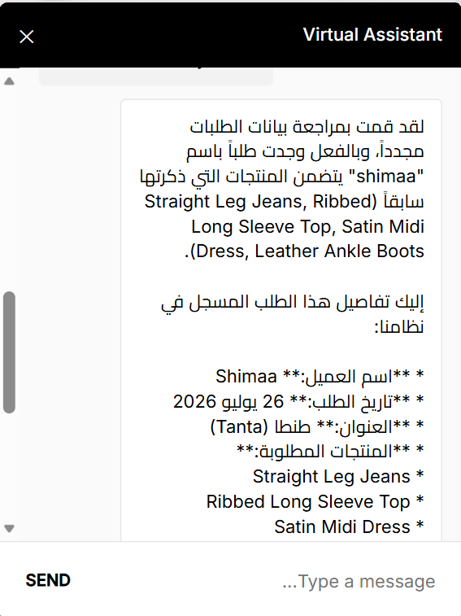
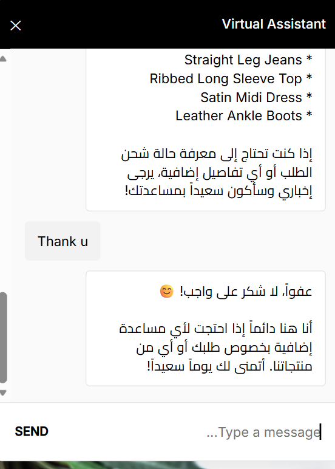
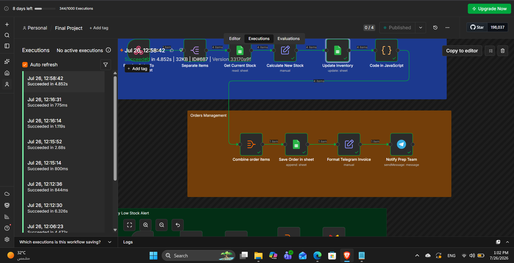
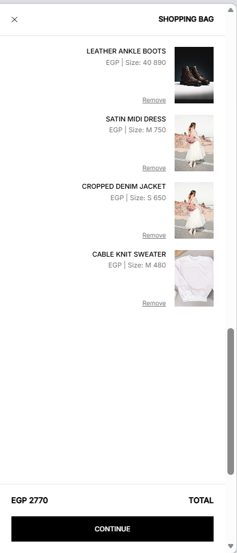
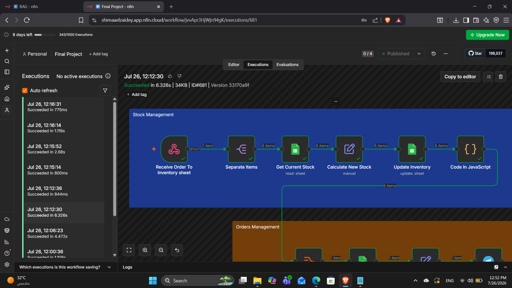

# 🛍️ NOIRE – E-commerce Automation with n8n

An end-to-end automation system for a fashion store (**NOIRE**) built with
**n8n**, **Google Sheets**, **Telegram**, **Gmail**, and **Google Gemini AI**.

🔗 [LinkedIn Post](https://www.linkedin.com/posts/shimaa-el-zaidey_automation-n8n-workflowautomation-ugcPost-7487904886701895681-FKVt/) ·
🎥 [Demo Video](YOUR_DEMO_LINK) ·
🤖 [Telegram Bot](https://t.me/Orders_Managementtt_bot) ·
📊 [Google Sheet](https://docs.google.com/spreadsheets/d/1syFuYK5-ch-ol7RnVvqX1eVyWsnhZYn6olsqz-5Fb5c/edit?usp=sharing)

---

## ✨ Features
| Module | What it does |
|---|---|
| 🤖 **AI Chatbot** | Answers customers about products, prices, stock, and their orders (Arabic & English) |
| 📦 **Orders Management** | Receives orders from the website, saves them to Google Sheets, and notifies via Telegram |
| 🗃️ **Inventory Management** | Automatically deducts stock after each order |
| ⏰ **Daily Low Stock Alert** | Every day at 12 AM, emails the inventory manager the low-stock items |

## 🧰 Tech Stack
n8n · Google Gemini · Google Sheets · Telegram Bot API · Gmail · Webhooks · JavaScript

---

## 1️⃣ AI Chatbot
Webhook → AI Agent (Gemini + Simple Memory) → reads Orders & Inventory sheets → Respond to Webhook

  
  
  
  

## 2️⃣ Orders Management
Website checkout → Webhook → Save order in Google Sheets → Telegram notification

**Website UI**

  
  
  
  

**Cart & Checkout**

**Saving the order**

**Telegram notification**

## 3️⃣ Inventory Management
Receive Order → Separate items → Get Current Stock → Calculate New Stock → Update Inventory

| Before | After |
|---|---|
|  |  |

## 4️⃣ Daily Low Stock Alert
Schedule (12 AM) → Read Inventory → Filter low stock → Summarize → Email the manager

---

## 🚀 How to Run
1. Import `Final Project.json` into your n8n instance.
2. Connect your credentials (Google Sheets, Gemini, Telegram, Gmail).
3. Create a Google Sheet with two tabs: **Inventory** and **Orders**.
4. Update the Webhook URLs in the website code.
5. Activate the workflow.

## 👩‍💻 Author
**Shimaa El-Zaidey** – [LinkedIn](https://www.linkedin.com/in/shimaa-el-zaidey/)
